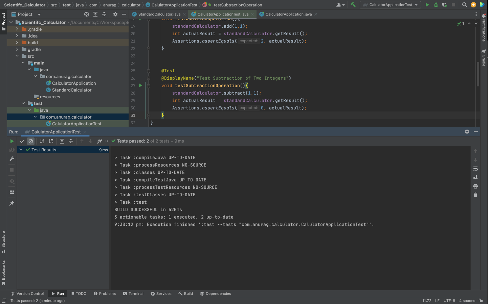
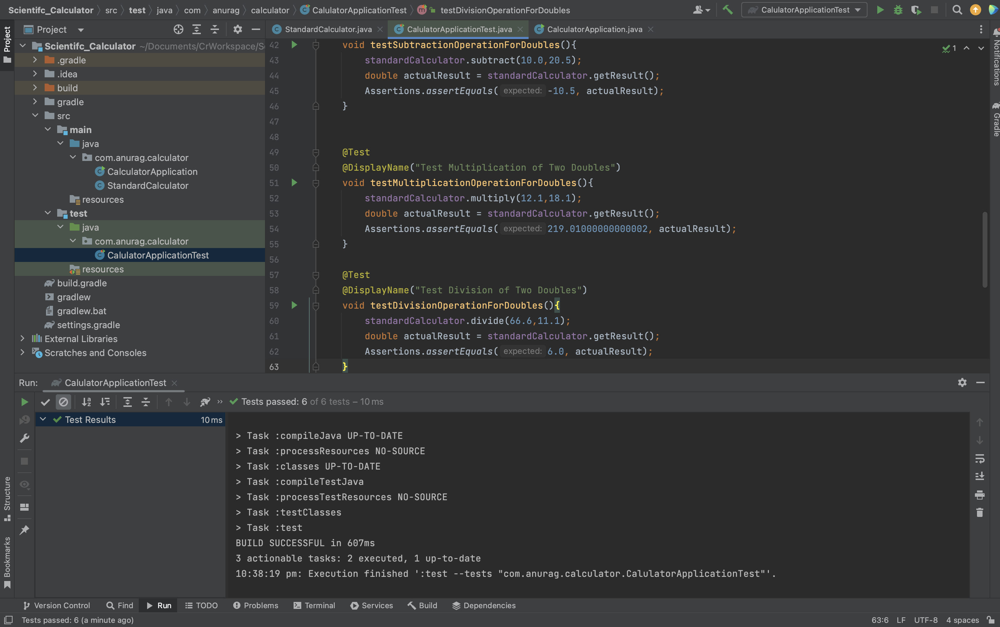
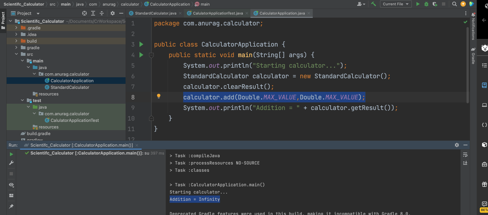
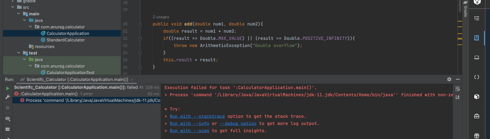
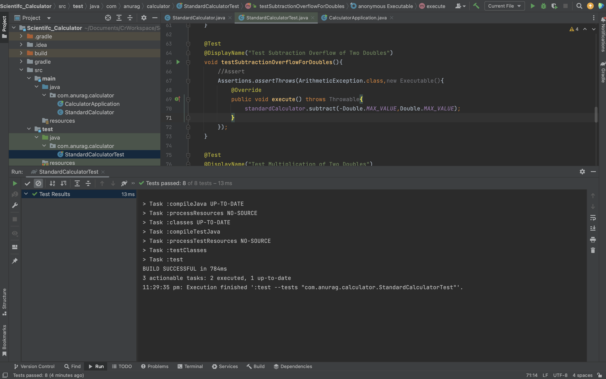
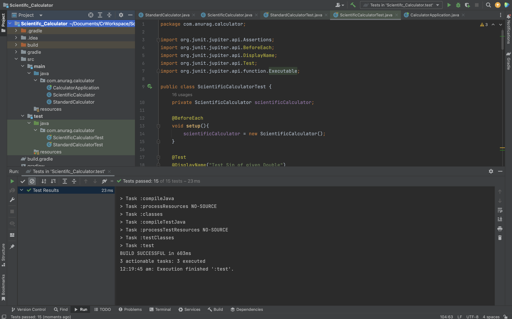
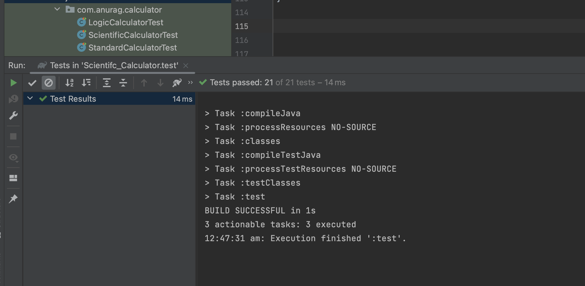

# Scientific_Calculator
To demonstrate Core Java Concepts - More Comprehensive Approach 

## Table of contents
* [Objective](#objective)
* Project Implementation :
* [Phase 1](#phase-1)
* [Phase 2](#phase-2)
* [Phase 3](#phase-3)
* [Phase 4](#phase-4)
* [Phase 5](#phase-5)

Also Checkout my other Core Java based Projects :
* [URL shortener - Basic Approach](https://github.com/anuragmaldhure/URL_Shortener)
* [Movie Review App - More Comprehensive Approach with RDMBS](https://github.com/anuragmaldhure/Movie_Review_Hackathon)

## Objectives
* Implementing OOPS using Java SE
* Implement basic arithmetic operations with two numbers
* Write Unit Tests for some of the arithmetic operations
* Execute and Test the calculator application
* Implement new methods to support floating point arithmetic operations using method overloading
* Debug and Handle Exceptions for invalid data
* Write unit tests to validate the Exception being thrown
* Extend the existing class to support new features for a Scientific Calculator
* Re-use and improve upon the existing features
* Fix compilation errors caused probably due to syntax / import issues
* Correct logical issues in the code
* Fix the behaviour of a method when data is invalid
* Write Unit Tests for edge cases initially not thought of

## Implementation

## Phase 1 
### Creating Standard Calculator, Basic operations and writing unit test case
1. Created a gradle project and created a class src/main/java/StandardCalulator.java and added a static method getVersion() to print version of Calculator 
2. Implemented these basic arithmetic operations :
```java
public int add(int num1, int num2)
public int subtract(int num1, int num2)
public int multiply(int num1, int num2)
public int divide(int num1, int num2)
```
4. Tesed them succesfully after calling them from class CalulatorAppliaction which has main method and invokes the above methods after creating object of StandardCalulator
5. Added a private field result in StandardCalulator.java and added getters and setters and modified result by setResult() and the CalulatorAppliaction.java to call getResult() after calling clearResult()
6. Wrote test case in src/test/java/CalulatorApplicationTest.java using junit 
7. Used annotations @BeforeEach [to mark methods to be run before each test method is run. We use this method mostly to set up a few initial things which are required for all the tests present in the Test Class. Here, we are initializing the standardCalculator variable with a new object] @Test [which is used to mark the testAdditionOperation() method as a test] @DisplayName [which is used to declare a custom display name for the annotated test class or test method] which is a tag that represents the metadata i.e. attached with a class, interface, methods or fields to indicate some additional information which can be used by java compiler and JVM. [Read more about JUNIT 5](https://www.baeldung.com/junit-5)
* A unit test is a way of testing a unit - the smallest piece of code that can be logically isolated in a system. It helps with the software development cycle by spotting bugs earlier as well as reducing testing time. It is recommended to have one Test class with unit tests for every Java class that needs testing.
7. There is an Assertions class which has a static method assertEquals() being used in some methods. Run these two test cases successfully!



## Phase 2 
### Applying basic OOPs concepts
1. Now we want to opertaions to be performed on float and decimal datatypes also. 
* The float data type is a single-precision 32-bit IEEE 754 floating point.Its value range is unlimited. It is recommended to use a float (instead of double) if you need to save memory in large arrays of floating point numbers. The float data type should never be used for precise values, such as currency. Its default value is 0.0F.
* The double data type is a double-precision 64-bit IEEE 754 floating point. Its value range is unlimited. The double data type is generally used for decimal values just like float. The double data type also should never be used for precise values, such as currency. Its default value is 0.0d.
* So overload the method : public void add(double num1, double num2) and other methods as well
2. To accomodate these changes, we need to change the datatype of result to double and getter and setter of result.
* When you assign a value of one data type to another, the two types might not be compatible with each other. If the data types are compatible, then Java will perform the conversion automatically known as Automatic Type Conversion and if not then they need to be cast or converted explicitly. For example, assigning an int value to a double variable.
* Widening conversion takes place when two data types are automatically converted. This happens when:
- The two data types are compatible.
- When we assign a value of a smaller data type to a bigger data type.
[Read more about type conversion](https://www.geeksforgeeks.org/type-conversion-java-examples/)
3. Make changes in test cases : testAdditionOperation() and testSubtractionOperation()
4. Also add new test cases for testing double methods : testAdditionOperationForDoubles(), testSubtractionOperationForDoubles(), testMultiplicationOperationForDoubles(), testDivisionOperationForDoubles(). All 6 test cases passed!



## Phase 3
### Debugging and handling Exceptions
1. What if we try to do something like this? 

Currently, the implementation silently overflows and the output we get is Infinity. Strange!
These should not be allowed to happen. If an operation causes an overflow to occur, one possible thing we can do is to throw an "exception" in the program.
[Overflow and Underflow in Java](https://www.baeldung.com/java-overflow-underflow)

* What are Exceptions? Exceptions are objects that describe abnormal flows of execution in the program. These are objects and can be "thrown". A program can then decide how to handle them or ignore them.

2. Modify add () : 
```java 
public void add(double num1, double num2){
    double result = num1 + num2;
    if((result == Double.MAX_VALUE) || (result == Double.POSITIVE_INFINITY)){
        throw new ArithmeticException("Double overflow");
    }
    this.result = result;
}
```
- Addition operation is performed normally and assigned to a newly created double variable.
- Conditional logic is applied based on our previous knowledge of how overflow works for double data types.
- The conditional block contains the statement which creates a new Object (of type ArithmeticException) which can be thrown to interrupt the normal execution of the program and handle it gracefully.
- If the operation is performed normally then the calculated result will be stored in the instance result variable, else an exception will be thrown.
Note that the flow is being interrupted here by throwing an exception. The thrown exception is not yet handled gracefully in the method that invokes the add() operation.

3. Now calc.add(Double.MAX_VALUE, 1.0) or calc.add(Double.MAX_VALUE, Double.MAX_VALUE) throws an error : 

Error stacktrace:
```java
Exception in thread "main" java.lang.ArithmeticException: Double overflow   
at com.crio.qcalc.StandardCalculator.add(StandardCalculator.java:39)
at com.crio.qcalc.QcalcApplication.main(QcalcApplication.java:7)  
```
* A stack trace provides information about the sequence of calls made in the program execution. Since exceptions are abnormal flows of program execution, this is useful in debugging. While stack traces can be intimidating when you first see them, reading through them might help get you halfway through the debugging of your code. The top-most line in a stack trace gives quite a lot of information to start your debugging process:
- Exception name
- Error message
- Actual line number where the error occurred.
Quite often, looking up portions of the error message on Google will narrow down your search significantly.
[Exceptions in Java](https://docs.oracle.com/javase/tutorial/essential/exceptions/definition.html) ||
[Reading java stack trace](https://www.twilio.com/blog/how-to-read-and-understand-a-java-stacktrace) || 
[what-is-a-stack-trace-and-how-can-i-use-it-to-debug-my-application-errors](https://stackoverflow.com/questions/3988788/what-is-a-stack-trace-and-how-can-i-use-it-to-debug-my-application-errors)

4. Modified subtract() also. 
5. Made chnages in StandardCalculatorTest.java to add new test cases : testAdditionOverflowForDoubles() and testSubtractionOverflowForDoubles(). Each of these methods tests the overflow behaviour of the methods modified.
* A static assertThrows method of Assertions class currently accepts two parameters. First parameter indicates the type of exception the method being tested should throw. Second parameter is an Executable object which has an overridden execute() method wrapping the method being tested. These tests will PASS if and only if the exception is thrown for some scenarios and matches the Exception type specified in the first parameter.
6. Passed all test cases!


[types-of-exception-in-java-with-examples](https://www.geeksforgeeks.org/types-of-exception-in-java-with-examples/) ||
[Executable (JUnit 5.0.3 API)](https://junit.org/junit5/docs/5.0.3/api/org/junit/jupiter/api/function/Executable.html) ||
[Java throws keyword](https://www.javatpoint.com/throws-keyword-and-difference-between-throw-and-throws) ||
[throwable-class-in-java-with-examples/](https://www.geeksforgeeks.org/throwable-class-in-java-with-examples/) 


## Phase 4
### Implementing Scientific Functionality by extending standard calculator
1. List of new operations to implement : Sine, Cosine, Tan, Log, Square Root, Cube Root, Square. Created a new ScientificCalculator.java class that inherits all the methods in the StandardCalculator.java class to get the advantage of re-use but not the burden that comes with modifying existing classes.
- square() method is using the implementation of the existing multiply() method which is inherited from the base class.
- there is a getVersion() method which has a keyword static and a return type of void. It prints the current version of the ScientificCalculator class.
2. Made access specifier of result field of StandardCalculator.java as protected instead of private
3. Wrote a method printResult() in StandardCalculator.java and overridden it in ScientificCalculator.java
* @Override annotation simply indicates that the superclass method is being overridden by an implementation of the child class. This annotation is not compulsory but makes it easy to identify that it’s an overridden method. Anytime we visit the code, we will know its overridden.
4. Make add() and other arithmetic methods final as well, so it can’t be overridden.
* The main intention of making a method final is that the functionality of the method should not be changed by anyone.
5. Wrote test cases for newly added methods in ScientificCalculator.java into ScientificCalculatorTest.java
6. All unit tests still work fine!


## Phase 5
### Implementing Logical Functionality by extending standard calculator
1. Wrote new class LogicCalculator.java to perform logical operations : AND &, OR |, XOR ^, NOT ~
2. Wrote corresponding test cases in LogicCalculatorTest.java 
* Used ARRANGE-ACT-ASSERT strategy while writing test case 
3. Modified : public final void multiply(double num1, double num2) to cancel out the Double Overflow by throwing exceptions for three cases
- Max Value
- Positive Infinity
- Negative Infinity
4. Also wrote corresponing test case : testMultiplicationOverflowForDoubles()
5. In StandardCalculator.java, a bug was found for divide operation. Divide by zero is not possible so replaced the logic
```java
public final void divide(double num1, double num2){
        if(num2 == 0.0){
            throw new ArithmeticException("Divide By Zero");
        }
        result = num1 / num2;
    }
```
6. Wrote the unit test to verify the exception is thrown for Divide by Zero : testMultiplicationOverflowForDoublesOnePosOtherNeg()
7. All unit tests works! 21 Test cases PASS! Abhi maza aaya na bidu!



NOTE - I have done commits phasewise so if I or anyone refer to this repo in future, he can understand changes in code by reading readme simultaneously :)

### My Core Java Practice Assignments (My CDAC assignments)
[Click here](https://github.com/D3-80316-Anurag-Maldhure/JAVA_Assignments)
